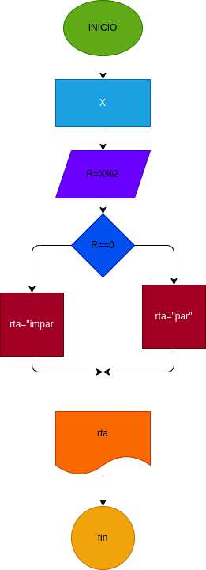

# EJERCICIO N.4

## programa para identificar si un numero es par o impar

# ANALISIS

variable de entrada(input)

X:un numero

variables de proceso y salida(processing, storage, output)
 
mod: r%2

rta=resultado de la decision

# DISEÑO

# CONSTRUCCION
